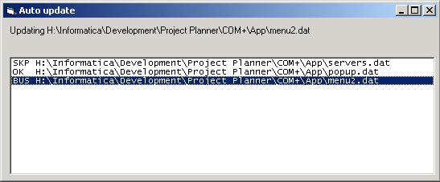



## AutoUpdate

### Description

Automatically update files using the internet. A very easy-to-use program that takes only a few commandline parameters. This can save you a lot of time if you're creating a multi-user application where many people use your program, no more running around the entire building.
 
### More Info
 
Usage

au.exe /url <url> [/app <app>] [/tmo <tmo>] [/ret <ret>]

/url <url>

Specifies the url where the version file can be found

/app <app>

If specified, the application to be started when the updating is completed

/tmp <tmo>

The connection timeout in seconds, if not specified, the default is used. default = 10

/ret <ret>

The number of retrys when a file can't be retrieved (eg when the server is busy)

The default is 2

Example

au.exe /url http://www.myserver.com/myfolder/version.dat /app myapp.exe

the version file has following format

"from","to",#date#

from: the url to the file the original file

to: the path to the file where the file must be saved to

date: a date/time containing the date and time that the file was changed

Example

"http://www.myserver.com/myfolder/myfile.dat","##apppath##\myfile.dat",#01/01/2001 7:25:00#

If TO contains ##apppath##, ##apppath## is replaced by the path of au.exe

             |
---                |---
**Submitted On**   |2001-04-12 16:04:12
**By**             |[Networking\.be](https://github.com/Planet-Source-Code/PSCIndex/blob/master/ByAuthor/networking-be.md)
**Level**          |Advanced
**User Rating**    |5.0 (15 globes from 3 users)
**Compatibility**  |VB 6\.0
**Category**       |[Complete Applications](https://github.com/Planet-Source-Code/PSCIndex/blob/master/ByCategory/complete-applications__1-27.md)
**World**          |[Visual Basic](https://github.com/Planet-Source-Code/PSCIndex/blob/master/ByWorld/visual-basic.md)
**Archive File**   |[AutoUpdate182644122001\.zip](https://github.com/Planet-Source-Code/networking-be-autoupdate__1-22340/archive/master.zip)

